# EstoqueIn · Gestão de estoque para pequenas empresas

Plataforma completa de controle de estoque: produtos, fornecedores, múltiplos estoques (depósito e lojas), entradas, saídas, transferências, inventário com leitor de código de barras, alertas automáticos de estoque mínimo, relatórios com curva ABC e importação via CSV.

Roda de duas formas com o **mesmo código**: como aplicação web e como **programa instalável no Windows** (Electron), funcionando offline, com backup automático.

> **Produto chegou → entrada registrada → saldo atualizado → sistema verifica o estoque mínimo → gera (ou resolve) o alerta.**
> Esse fluxo acontece numa única transação no banco e é mostrado passo a passo na interface.

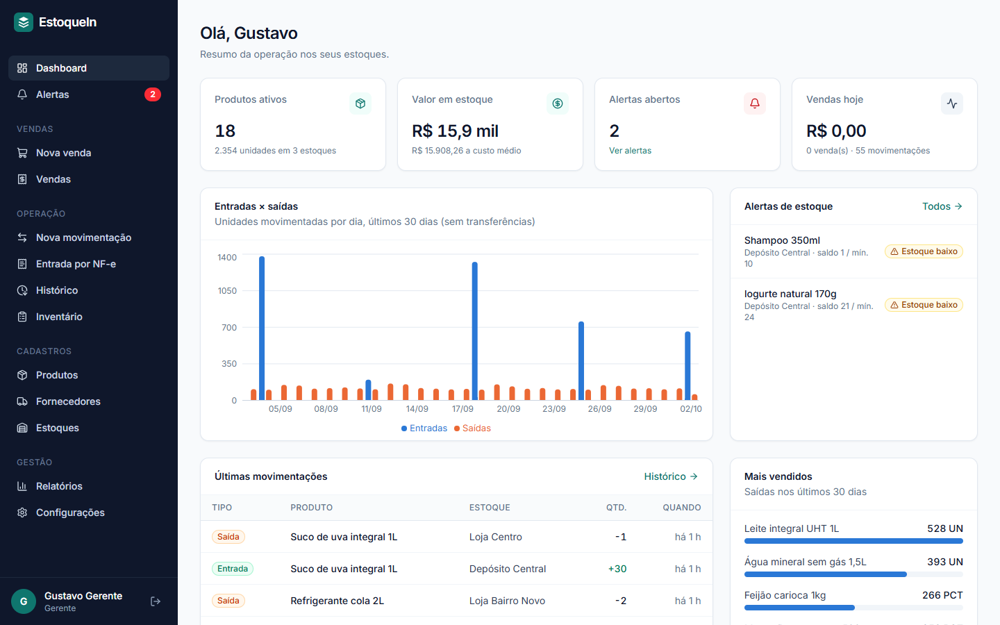

---

## Funcionalidades

| Área | O que faz |
|---|---|
| **Produtos** | Cadastro com SKU, código de barras (EAN/GTIN validado), categoria, unidade, preço, **custo médio ponderado** recalculado a cada entrada e estoque mínimo; **categorias** podem ser renomeadas, juntadas ou removidas de uma vez |
| **Fornecedores** | Cadastro com CNPJ, contato e vínculo com produtos |
| **Estoques** | Vários locais (depósito, lojas), saldo por local e **mínimo específico por estoque** |
| **Vendas (caixa)** | Leitura por código de barras ou **etiqueta da balança**, total, desconto, troco, pagamento em uma ou duas formas, **notinha** para impressora térmica, cancelamento, **devolução parcial** com estorno proporcional e relatório com lucro |
| **Fechamento de caixa** | Abertura com o troco, sangria e suprimento, resumo por forma de pagamento e fechamento com o dinheiro contado: a diferença (falta ou sobra) fica registrada e o comprovante sai na bobina. Com **troco fixo** (ex.: R$ 250), o fechamento diz quanto retirar para sobrar esse valor, e a abertura do dia seguinte já vem preenchida e avisa se não bater |
| **Fiado (caderneta digital)** | Venda no fiado (inteira ou só uma parte), com limite opcional por cliente e o **fiado anterior** de cada um passado do caderno. Mostra quem deve, quanto e desde quando, recebe pagamentos parciais, tem o extrato de cada cliente e o botão de cobrança pelo WhatsApp. Cancelamentos e devoluções abatem a dívida sozinhos, e o fiado recebido em dinheiro entra na conferência do caixa |
| **Cartão fidelidade** | Regras como "a cada 10 sacos de ração, ganha 1 petisco" (por produto ou categoria). O progresso é calculado pelas compras do cliente; no caixa aparece quanto falta e, quando ele tem direito, o brinde entra na venda a R$ 0,00 com um clique |
| **Promoções com prazo** | Preço promocional ou "leve X, pague Y" entre duas datas. O servidor aplica sozinho; a tela de venda e a notinha mostram a economia. Depois do prazo, o preço volta ao normal |
| **Entregas** | Venda para entrega com o endereço salvo no cadastro do cliente, **taxa automática** abaixo de um valor de compra (ex.: R$ 5,00 abaixo de R$ 40,00, com opção de não cobrar), pago antes ou **cobrado na entrega** (com o troco que o entregador leva) e entrega agendada. Painel com o que separar, o que saiu e o que foi entregue, prazo com aviso de atraso, mensagem de "saiu para entrega" pelo WhatsApp, **guia de entrega** na bobina e acerto com cada entregador |
| **Kits** | Produto com preço próprio formado por outros (ração + petisco + brinquedo). Vender o kit baixa o estoque de cada item; devolução e cancelamento devolvem. Mostra quantos kits dá para montar e o custo |
| **Contas a pagar** | Boletos, aluguel e luz com vencimento, conta mensal que se repete sozinha, pagamento com dinheiro da gaveta (vira sangria no caixa) e aviso na tela inicial das vencidas e das que vencem em 7 dias. O pedido de compra pode virar conta. Só administrador e gerente acessam |
| **Clientes e recompra** | Cadastro rápido na hora da venda (nome e WhatsApp), histórico de compras e **lembrete de recompra**: pelo intervalo médio entre as compras, o sistema avisa quem está para voltar e abre a conversa no WhatsApp com a mensagem pronta |
| **Venda por peso e granel** | Produtos fracionados (kg, L, m) com 3 casas decimais; **fracionamento**: abrir um saco fechado transforma 1 saco em 15 kg de granel, levando o custo proporcional |
| **Entrada por NF-e (XML)** | Importa o XML da nota do fornecedor: cadastra fornecedor e produtos novos, reconhece itens pelo código do fornecedor, código de barras ou nome, converte embalagens (CX, FD) e dá entrada com o **custo real** (frete, IPI e ICMS-ST rateados) |
| **Entrada / Saída** | Registro com nota fiscal, fornecedor, custo e motivo; saída manual nunca deixa o saldo negativo. A venda pode, se a loja permitir, deixar o saldo negativo, com alerta para conferir |
| **Transferência** | Saída da origem + entrada no destino na mesma transação, ligadas por um `transferId` |
| **Estoque mínimo e alertas** | Alerta aberto automaticamente ao atingir o mínimo, agravado quando zera (ou fica negativo) e **resolvido sozinho** quando há reposição; marcação de "ciente" |
| **Histórico** | Registro imutável de toda movimentação, com saldo resultante, usuário e filtros; exportação CSV |
| **Inventário** | Contagem física (total ou por categoria), contagem por **leitor de código de barras**, divergências e ajuste automático ao concluir |
| **Usuários e permissões** | 4 perfis (Administrador, Gerente, Operador, Somente leitura) com matriz de permissões aplicada na API e na interface. Faturamento, lucro, custo, margem, valor do estoque e relatórios só para administrador e gerente: para os outros perfis esses números nem saem do servidor |
| **Registro de alterações** | Quem cadastrou ou alterou o quê e quando, com o valor antigo e o novo (preços, cadastros, usuários, configurações, importações, cancelamentos). Só leitura |
| **Senhas** | Troca pelo próprio usuário, senha temporária com troca obrigatória e **recuperação de acesso do administrador sem internet**, pelo menu do programa instalado |
| **Pedidos de compra** | A sugestão de compra vira pedido para cada fornecedor: ajusta as quantidades, envia pelo WhatsApp ou imprime/salva em PDF. Enquanto o pedido não chega, a sugestão não pede os mesmos produtos de novo |
| **Relatórios** | **Fechamento do mês** (vendas, lucro, contas pagas, resultado, fiado, caixa e estoque numa página para imprimir), posição de estoque valorizada, **sugestão de compra** (pelo consumo médio, descontando o que já foi pedido, agrupada por fornecedor), **produtos parados** (dinheiro empatado), movimentações por período e **curva ABC**, todos exportáveis em CSV (abre direto no Excel) |
| **Importação CSV** | Pré-visualização (dry-run) com erros por linha, separador `;` ou `,`, UTF-8 ou Windows-1252 (Excel), cria ou atualiza por SKU; aceita o **saldo atual** de cada produto, para migrar de outro sistema numa planilha só |
| **Código de barras** | Leitura via leitor USB (o campo de produto entende o "Enter" do leitor), geração de EAN-13 interno e **impressão de etiquetas** |
| **Integrações externas** | Consulta de produto pelo código de barras na [Open Food Facts](https://world.openfoodfacts.org) e **webhook** de alertas (compatível com Discord, Slack, n8n, Zapier) |
| **Ajuda dentro do programa** | Central de ajuda com mais de 70 perguntas frequentes e busca, e um **assistente** que entende a dúvida escrita do jeito da pessoa ("retirei dinheiro pra pagar o motoboy" → sangria). Abre com **F1** em qualquer tela, já com as dúvidas daquela tela. Tudo sem internet; quando não acha a resposta, abre o WhatsApp do suporte com a dúvida e a versão escritas |
| **Primeira execução** | Tela de boas-vindas para criar o administrador e o estoque principal, ou carregar a demonstração |
| **Versão desktop** | Instalador para Windows, banco local, funciona sem internet, backup automático diário, **cópia diária para fora do computador** (pendrive ou pasta do Google Drive/OneDrive), backup e restauração pelo menu e **arquivo de diagnóstico** para o suporte |

## Telas

| Nova movimentação (fluxo do alerta) | Alertas |
|---|---|
| 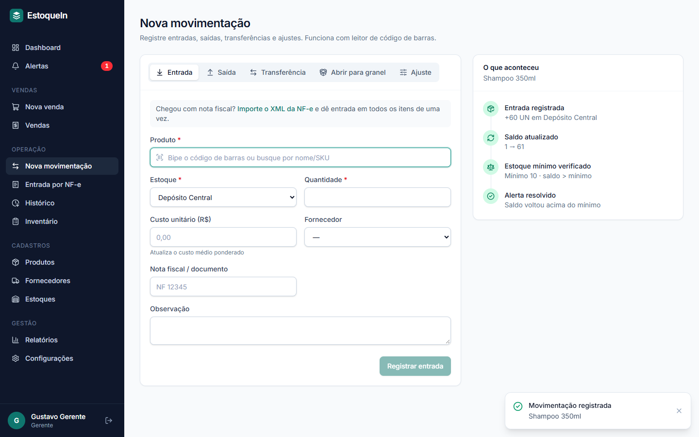 | 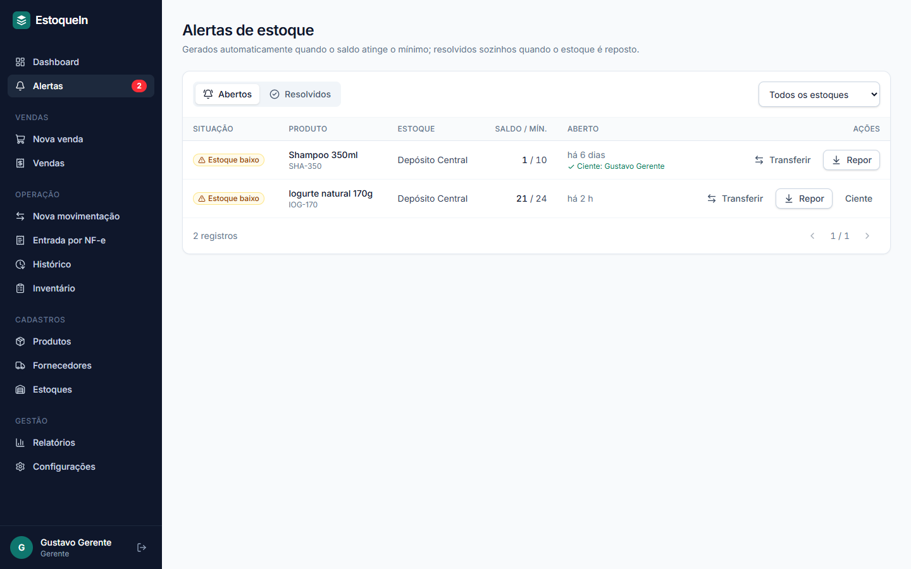 |

| Entrada por NF-e (conferência antes de gravar) | |
|---|---|
| 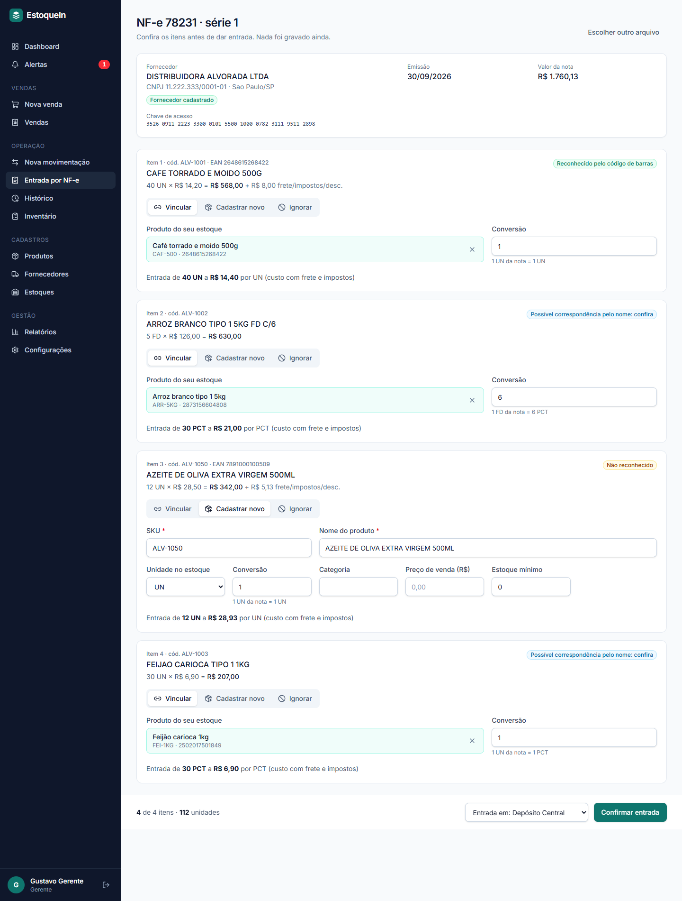 | |

| Produto | Curva ABC |
|---|---|
| 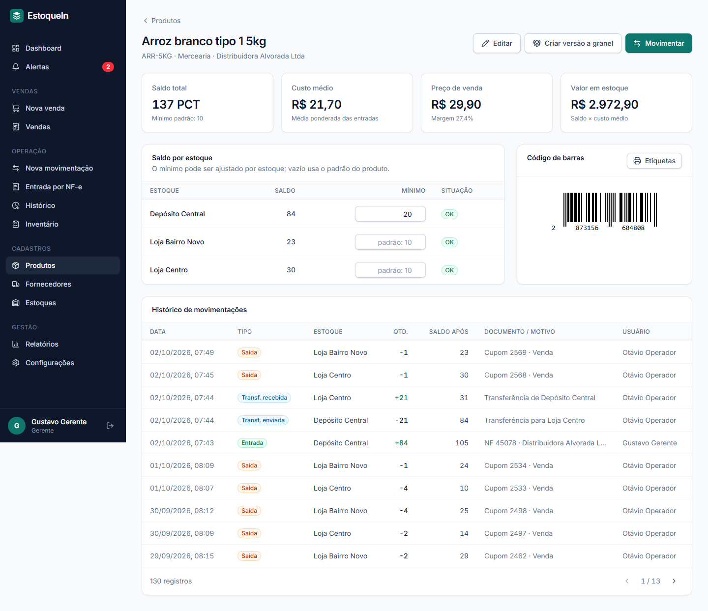 | 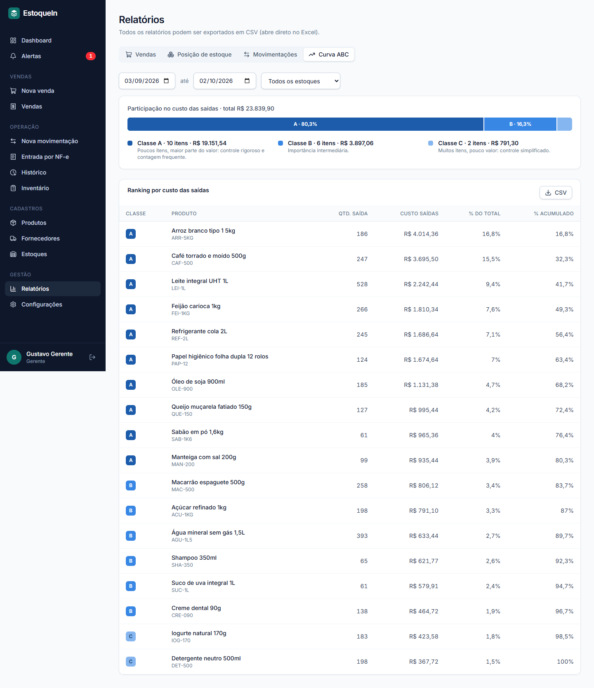 |

| Inventário com leitor | Importação CSV |
|---|---|
| 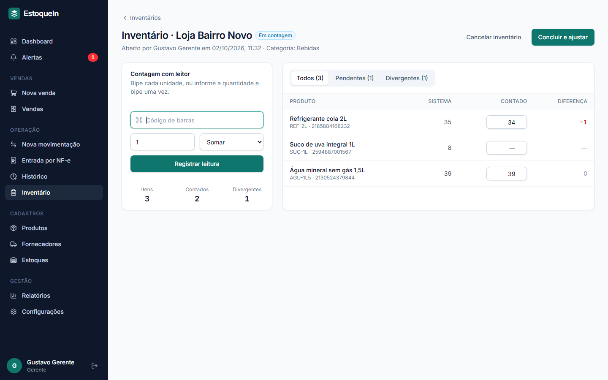 | 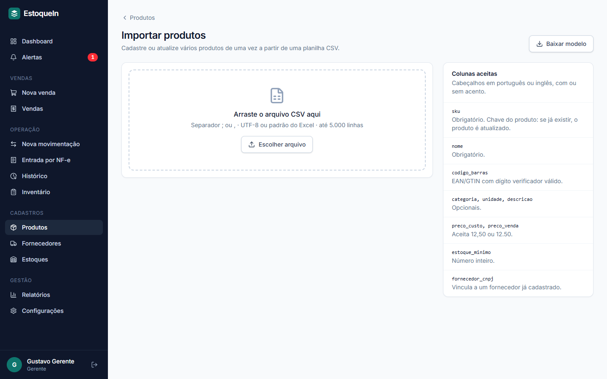 |

<details>
<summary>Login e versão mobile</summary>

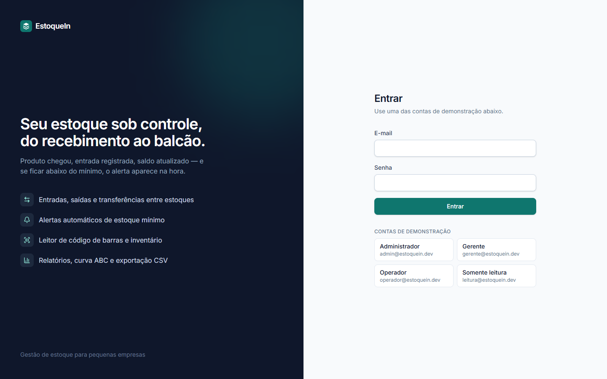

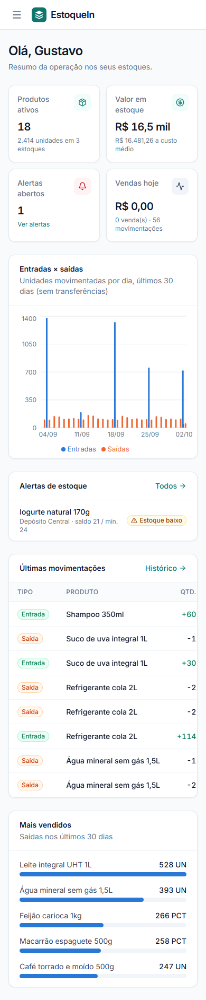
</details>

---

## O fluxo principal

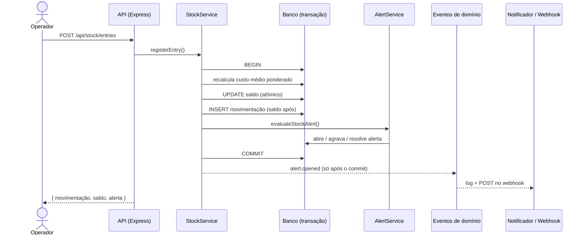

Decisões que garantem a consistência:

- **Saldo nunca negativo, mesmo com acessos simultâneos.** O novo saldo é gravado com comparar-e-gravar (`UPDATE ... WHERE quantity = <saldo lido>`): se outra operação alterou o saldo no meio do caminho, a gravação não acontece e a operação é recusada, em vez de duas saídas "gastarem" o mesmo estoque.
- **Quantidades decimais sem erro de arredondamento.** Produtos vendidos por peso aceitam 3 casas (0,001). Todo saldo é arredondado antes de gravar, então `0,1 + 0,2` dá `0,3` e vender exatamente o que resta zera o estoque, sem resíduos de ponto flutuante.
- **Movimentação, saldo e alerta na mesma transação.** Ou tudo é gravado, ou nada. Uma transferência sem saldo na origem não deixa a entrada no destino "pela metade".
- **Eventos publicados só depois do commit.** Notificações e webhooks nunca avisam sobre algo que foi desfeito, e uma falha no webhook não afeta a operação.
- **Histórico imutável.** O saldo é derivado das movimentações. Correções viram ajustes, nunca edição de histórico.
- **No máximo um alerta aberto por produto e estoque.** O alerta é atualizado, escalado para "sem estoque" ou resolvido, em vez de duplicado.
- **Inventário ajusta pelo saldo atual, não pela "foto".** Vendas feitas durante a contagem não são desfeitas ao concluir.

## Vendas no balcão

| Caixa | Notinha e configurações |
|---|---|
| 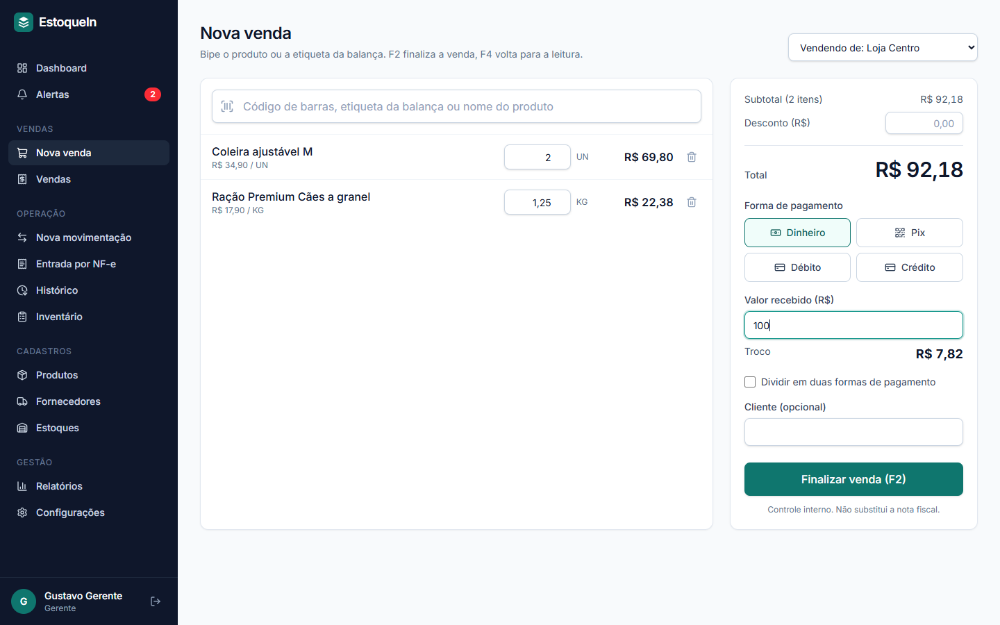 | 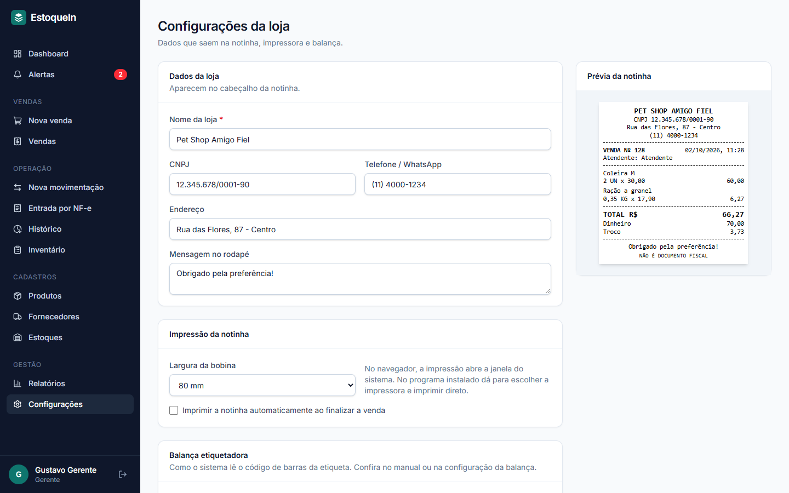 |

- **Um campo de leitura para tudo.** O que for bipado é identificado nesta ordem: código de barras do produto, etiqueta da balança, SKU. Digitando um nome, aparece a busca.
- **Etiqueta da balança.** A balança etiquetadora imprime um EAN-13 com o código do produto e o peso (ou o preço). O sistema lê a etiqueta e já lança, por exemplo, 1,250 kg do produto certo. O formato é configurável.
- **Uma transação por venda.** Venda, itens, pagamentos e a baixa de estoque de todos os itens são gravados juntos. Se faltar estoque de um item, nada é gravado e a mensagem diz qual produto faltou.
- **Preço sempre do cadastro.** O servidor ignora qualquer preço enviado pelo navegador.
- **Lucro real.** Cada item guarda o custo médio do momento da venda, então o relatório mostra faturamento, lucro bruto, ticket médio e formas de pagamento (o dinheiro já sem o troco).
- **Cancelamento rastreável.** Só gerente ou administrador cancela, com motivo. Os itens voltam ao estoque e a venda permanece no histórico.
- **Devolução parcial.** O cliente devolve um item (ou 0,5 kg de 2 kg): só aquilo volta ao estoque, e o estorno sai pela forma escolhida. Se a venda teve desconto, o estorno é proporcional ao que o cliente pagou. Não é possível devolver mais do que foi vendido, somando devoluções anteriores.
- **Caixa.** Com a opção ligada (padrão), só se vende com o caixa aberto. O dinheiro esperado na gaveta é calculado como troco inicial + vendas em dinheiro (sem o troco dado) + suprimentos − sangrias − devoluções em dinheiro; no fechamento, o valor contado e a diferença ficam gravados para sempre.
- **Estoque zerado não trava o balcão (opcional).** Se o estoque do sistema estiver errado, a loja pode vender mesmo assim: o saldo fica negativo e abre um alerta "Estoque negativo" para conferência. Saídas manuais e transferências continuam sem poder deixar saldo negativo.
- **Cliente na venda.** Busca por nome ou telefone, ou cadastro na hora. A venda entra no histórico do cliente e alimenta o lembrete de recompra.
- **Notinha.** Comprovante para bobina de 58 ou 80 mm, com os dados da loja. No programa instalado, sai direto na impressora escolhida, sem janela de confirmação. **Não é documento fiscal**: a emissão de NFC-e não faz parte do sistema.
- **Pensado para o teclado:** F2 finaliza a venda e F4 volta para o campo de leitura.
- **Botões rápidos:** até 8 produtos na tela de venda, entrando com um clique: os marcados no cadastro e, completando, os mais vendidos dos últimos 30 dias.
- **Fiado:** forma de pagamento que exige o cliente, mostra a dívida e o limite na hora e imprime na notinha o total em aberto com linha para assinatura. O saldo nunca é gravado: é recalculado a partir das vendas, devoluções e pagamentos, então não há como "desencontrar".

## Entrada de mercadoria pelo XML da NF-e

O XML é o arquivo que o fornecedor envia junto com a nota (o PDF é só a DANFE). O sistema lê a nota, mostra uma **conferência** e só grava depois da confirmação:

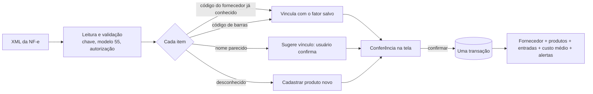

- **Aprende com o uso.** Ao confirmar, o vínculo *código do fornecedor → produto* (com o fator de conversão) é salvo. Na próxima nota do mesmo fornecedor, os itens já chegam reconhecidos.
- **Conversão de embalagem.** "FD C/6", "CX C/12" ou "DZ" geram a sugestão do fator: 5 fardos entram como 30 unidades.
- **Custo real.** Frete, seguro, outras despesas, IPI e ICMS-ST do item entram no custo; o desconto sai. O resultado alimenta o custo médio ponderado.
- **Segurança.** A chave de acesso (com dígito verificador) impede importar a mesma nota duas vezes. Quantidades e valores são sempre relidos do XML no servidor, nunca vindos do navegador. Se qualquer item falhar, nada é gravado.
- **Permissões.** Operadores podem dar entrada vinculando itens existentes; cadastrar produtos novos pela nota exige perfil de gerente ou administrador.

Para testar, use a nota fictícia [`docs/exemplos/nfe-exemplo.xml`](docs/exemplos/nfe-exemplo.xml), feita para os dados de demonstração: um item é reconhecido pelo código de barras, dois pelo nome (um deles em fardo com 6) e um é produto novo.

## Venda a granel: abrir pacote para vender por peso

Caso típico de pet shop: a ração chega em sacos de 15 kg, e parte é vendida fechada e parte por quilo.

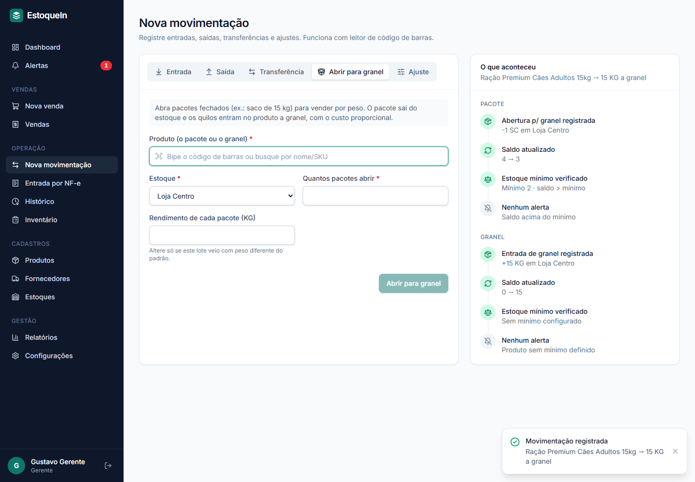

- São dois produtos ligados: o **pacote** (unidades inteiras) e o **granel** (kg, com casas decimais). Na tela do pacote, "Criar versão a granel" cadastra o segundo já vinculado.
- **Abrir para granel** tira o pacote do estoque e coloca os quilos no granel numa única transação, registrada no histórico dos dois produtos.
- **O custo vai junto.** Saco de R$ 150 com 15 kg entra no granel a R$ 10,00/kg, e o custo médio do granel é recalculado a cada abertura. Assim a margem da venda por quilo fica correta.
- O rendimento pode ser ajustado na hora (um saco que veio com 14,8 kg), e cada produto tem seu próprio estoque mínimo: alerta de "poucos sacos" e de "pouco granel" são independentes.
- A perda natural da pesagem é acertada pelo inventário, que aceita contagem em kg.

## Arquitetura

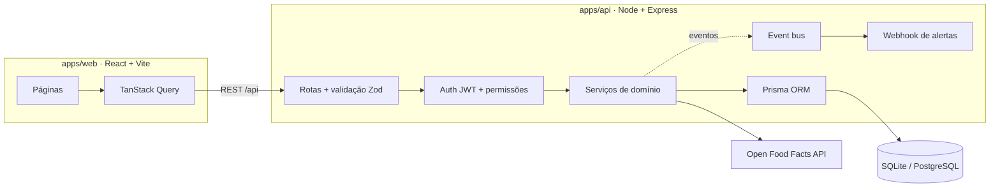

```
estoquein/
├── apps/
│   ├── desktop/              # App Windows (Electron): empacota a API + a interface
│   ├── api/                  # API REST
│   │   ├── prisma/           # schema, migrations e seed (45 dias simulados)
│   │   ├── src/
│   │   │   ├── auth/         # matriz de permissões e JWT
│   │   │   ├── lib/          # erros, eventos, CSV, código de barras, paginação
│   │   │   ├── middleware/   # autenticação e tratamento de erros
│   │   │   └── modules/      # products, stock, alerts, inventory, reports...
│   │   └── tests/            # testes de integração e unitários (Vitest + Supertest)
│   └── web/                  # SPA React
│       └── src/
│           ├── components/   # UI reutilizável, leitor de código, tabela de movimentos
│           ├── lib/          # cliente HTTP, auth, formatação, tipos
│           └── pages/
└── docs/screenshots/
```

## Stack

**Back-end:** Node.js, TypeScript, Express 5, Prisma ORM, SQLite (pronto para PostgreSQL), Zod, JWT, bcrypt, Helmet, rate limiting, Multer, csv-parse
**Front-end:** React 19, TypeScript, Vite, Tailwind CSS 4, TanStack Query, React Router, Recharts, JsBarcode, Lucide
**Desktop:** Electron, electron-builder (instalador NSIS), esbuild
**Qualidade:** Vitest, Supertest, TypeScript estrito, Prettier, GitHub Actions

---

## Como rodar

Pré-requisito: **Node.js 20.11+**. Não precisa de Docker nem de banco instalado.

```bash
npm install
npm run setup   # cria o .env, aplica as migrations e popula o banco com dados de demonstração
npm run dev     # sobe a API (porta 3333) e o front-end (porta 5173)
```

Acesse **http://localhost:5173** e entre com uma das contas abaixo (também há botões de atalho na tela de login):

| Perfil | E-mail | Senha |
|---|---|---|
| Administrador | admin@estoquein.dev | Admin@123 |
| Gerente | gerente@estoquein.dev | Gerente@123 |
| Operador | operador@estoquein.dev | Operador@123 |
| Somente leitura | leitura@estoquein.dev | Leitura@123 |

O seed simula ~45 dias de operação de uma pequena rede de mercearias fictícia: compras semanais, transferências do depósito para as lojas, vendas diárias e perdas. Ele usa o mesmo serviço de estoque da API, então os alertas abertos e resolvidos no histórico são consequência real das regras.

> **Dica:** para testar a integração com a Open Food Facts, cadastre um produto com o código `3017620422003` e clique em **Buscar**.

### Outros comandos

```bash
npm test              # testes da API
npm run typecheck     # checagem de tipos dos dois apps
npm run build         # build de produção
npm start             # API servindo também o front-end compilado (um único serviço)
npm run db:reset      # recria o banco do zero e roda o seed novamente
```

## Versão desktop (Windows)

```bash
npm run desktop:dev    # abre o app desktop em modo de desenvolvimento
npm run desktop:dist   # gera o instalador em apps/desktop/release/EstoqueIn-Setup-<versão>.exe
```

Como funciona:

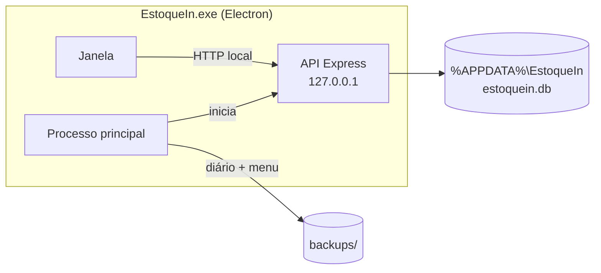

- **Mesmo código da versão web.** O processo principal sobe a API dentro do app, presa ao endereço local `127.0.0.1` (inacessível pela rede), e a janela carrega a interface servida por ela.
- **Banco local** em `%APPDATA%\EstoqueIn\estoquein.db` (SQLite em modo WAL). Desinstalar o programa não apaga os dados.
- **Migrations na inicialização.** Ao instalar uma versão nova, o banco é atualizado sozinho, sem depender da CLI do Prisma.
- **Backup automático diário** (mantém os 10 mais recentes) e, no menu **Arquivo**, backup manual e restauração. Antes de restaurar, os dados atuais são copiados.
- **Cópia fora do computador.** Em Configurações, escolhe-se um pendrive ou uma pasta do Google Drive/OneDrive. Uma vez por dia o banco é copiado para lá (as 7 últimas cópias ficam guardadas). A cópia é gerada primeiro no disco local e só então enviada com nome provisório, para o programa de sincronização nunca pegar um arquivo pela metade. Pendrive desconectado não trava nada: o erro aparece na tela e o sistema tenta de novo a cada hora.
- **Aviso na tela inicial** quando a cópia fora do computador não está configurada, está falhando (pendrive desconectado) ou parada há mais de 2 dias.
- **Arquivo de diagnóstico.** **Ajuda → Gerar arquivo de diagnóstico** salva um `.txt` com versão, estado do banco (migrations, contagens, verificação de integridade), backups e o final do log. Não leva o banco nem dados de clientes, produtos ou vendas.
- **Primeira execução:** cria o administrador e o estoque principal. As contas de demonstração só aparecem se a demonstração for carregada.
- **Troca de nome sem perder dados.** O programa se chamava StockFlow; na primeira abertura, o EstoqueIn copia os dados da pasta antiga (`%APPDATA%\StockFlow`), sem alterá-la.
- **Uma instância por vez**, segredo de autenticação gerado na instalação, links externos abertos no navegador e log em `%APPDATA%\EstoqueIn\logs`.

> O instalador não é assinado digitalmente. Por isso o Windows exibe o aviso "o Windows protegeu o computador" (clique em **Mais informações → Executar assim mesmo**). Para distribuir comercialmente, é preciso um certificado de assinatura de código.

### Variáveis de ambiente (`apps/api/.env`)

| Variável | Descrição |
|---|---|
| `DATABASE_URL` | Conexão do banco (padrão: SQLite local) |
| `JWT_SECRET` | Segredo de assinatura dos tokens |
| `CORS_ORIGIN` | Origens permitidas |
| `APP_TIMEZONE` | Fuso usado em "hoje" e nos gráficos por dia (padrão `America/Sao_Paulo`) |
| `ALERT_WEBHOOK_URL` | Opcional: recebe um `POST` JSON a cada alerta aberto |
| `BARCODE_LOOKUP_ENABLED` | Liga/desliga a consulta na Open Food Facts |

## API

Todas as rotas (exceto login e health) exigem `Authorization: Bearer <token>`.

| Método | Rota | Descrição | Permissão |
|---|---|---|---|
| `POST` | `/api/auth/login` | Login, devolve token e permissões | — |
| `GET` | `/api/dashboard` | Indicadores, gráfico e últimas movimentações | autenticado |
| `GET/POST/PATCH` | `/api/products` | Listagem com filtros, cadastro e edição | `products:write` para gravar |
| `GET` | `/api/products/by-barcode/:code` | Busca pelo código de barras | autenticado |
| `POST` | `/api/products/:id/barcode` | Gera EAN-13 interno | `products:write` |
| `PUT` | `/api/products/:id/stock/:warehouseId/min` | Mínimo específico por estoque | `products:write` |
| `POST` | `/api/products/import?dryRun=true` | Importação CSV | `products:import` |
| `POST` | `/api/stock/entries` · `exits` · `transfers` | Movimentações | `stock:move` |
| `POST` | `/api/stock/adjustments` | Ajuste manual com motivo | `stock:adjust` |
| `GET` | `/api/stock/movements?format=csv` | Histórico filtrável / exportação | autenticado |
| `GET` | `/api/alerts` · `/api/alerts/summary` | Alertas e contadores | autenticado |
| `POST` | `/api/alerts/:id/acknowledge` | Marcar como ciente | `alerts:ack` |
| `POST` | `/api/inventories` · `/:id/scan` · `/:id/complete` | Ciclo do inventário | `inventory:*` |
| `GET` | `/api/reports/stock-position` · `movements` · `abc` | Relatórios (JSON ou CSV) | `reports:read` |
| `GET` | `/api/integrations/barcode/:code` | Consulta na Open Food Facts | autenticado |
| `POST` | `/api/nfe/preview` · `/api/nfe/import` | Conferência e importação do XML da NF-e | `stock:move` |
| `GET` | `/api/nfe` | Notas importadas | autenticado |
| `POST` | `/api/sales` | Registra a venda e baixa o estoque | `sales:create` |
| `GET` | `/api/sales/resolve?code=` | Identifica o que foi bipado (produto, etiqueta de balança, SKU) | `sales:create` |
| `POST` | `/api/sales/:id/cancel` | Cancela a venda e devolve ao estoque | `sales:cancel` |
| `POST` | `/api/sales/:id/returns` | Devolução parcial de itens, com estorno | `sales:cancel` |
| `GET` | `/api/cash` · `/api/cash/current` · `/api/cash/:id` | Caixas, caixa aberto e resumo | autenticado |
| `POST` | `/api/cash/open` · `/:id/movements` · `/:id/close` | Abertura, sangria/suprimento e fechamento | `sales:create` |
| `GET/POST/PATCH` | `/api/customers` | Clientes (busca por nome ou telefone) | `sales:create` para gravar |
| `GET` | `/api/customers/reminders?days=7` | Lembretes de recompra | autenticado |
| `GET` | `/api/reports/purchase-suggestion` · `stale-products` | Sugestão de compra e produtos parados (JSON ou CSV) | `reports:read` |
| `GET` | `/api/customers/debtors` · `/api/customers/:id/account` | Quem deve no fiado e extrato do cliente | autenticado |
| `POST` | `/api/customers/:id/payments` | Recebe pagamento de fiado (total ou parcial) | `sales:create` |
| `GET/POST` | `/api/purchase-orders` · `/:id/status` | Pedidos de compra: criar, listar, marcar como recebido ou cancelado | `products:write` para gravar |
| `GET` | `/api/sales/quick-products` | Botões rápidos da tela de venda | `sales:create` |
| `POST` | `/api/customers/:id/payments/:paymentId/cancel` | Estorno de pagamento de fiado | `sales:cancel` |
| `GET` | `/api/customers/:id/loyalty` · `CRUD /api/loyalty-rules` | Cartão fidelidade do cliente e regras | `settings:manage` para gravar regras |
| `GET/POST` | `/api/promotions` · `/active` · `/:id/end` | Promoções com prazo | `products:write` para gravar |
| `PUT` | `/api/products/:id/kit` | Composição do kit | `products:write` |
| `GET/POST/PATCH` | `/api/bills` · `/summary` · `/:id/pay` · `/:id/cancel` | Contas a pagar | `bills:manage` (administrador e gerente) |
| `GET` | `/api/reports/monthly?from=&to=` | Fechamento do mês | `reports:read` |
| `GET` | `/api/reports/sales` | Faturamento, lucro e formas de pagamento (JSON ou CSV) | `reports:read` |
| `GET/PUT` | `/api/settings` | Dados da loja, notinha e balança | `settings:manage` para gravar |
| `GET` | `/api/audit` | Registro de alterações (não há rota para editar ou apagar) | `audit:read` |
| `POST` | `/api/auth/change-password` | Troca da própria senha | autenticado |
| `CRUD` | `/api/suppliers` · `/api/warehouses` · `/api/users` | Cadastros | por recurso |

Erros seguem um formato único: `{ "error": { "code": "INSUFFICIENT_STOCK", "message": "...", "details": {...} } }`.

### Webhook de alertas

Com `ALERT_WEBHOOK_URL` definido, cada alerta aberto gera:

```json
{
  "event": "stock.alert.opened",
  "text": "⚠️ Estoque baixo: Café 500g (CAF-500) em Loja Centro — saldo 8 UN, mínimo 12",
  "alert": { "type": "LOW_STOCK", "quantity": 8, "threshold": 12, "product": { "sku": "CAF-500" }, "warehouse": { "name": "Loja Centro" } }
}
```

Os campos `text` e `content` permitem apontar o webhook direto para Slack ou Discord.

## Testes

159 testes cobrindo as regras de negócio pela API real (banco SQLite descartável, criado a partir das migrations):

- fluxo entrada → saldo → mínimo → alerta (abrir, escalar, resolver, mínimo por estoque, evento após commit)
- saída sem saldo (422, sem efeitos colaterais) e transferência atômica
- custo médio ponderado e ajuste manual
- inventário: foto do saldo, contagem por leitor, conclusão com ajustes e permissões
- importação CSV: dry-run, erros por linha, `;` e `,`, cabeçalhos em PT/EN
- autenticação, usuário desativado e matriz de permissões
- validação de GTIN, conversão de valores e geração de CSV
- configuração inicial (primeira execução) e backup do banco
- segurança: recuperação de acesso do administrador, senha temporária que bloqueia o uso até a troca, registro de alterações com valor antigo e novo, e a garantia de que senhas nunca aparecem no registro
- importação de planilha com saldo, produto por peso e código de balança
- vendas: total com itens por peso, numeração, desconto, troco, pagamento dividido, falta de estoque desfaz tudo, alerta de mínimo, cancelamento, leitura de etiqueta de balança (peso e preço) e relatório de lucro
- caixa: venda bloqueada com o caixa fechado, um caixa por estoque, dinheiro esperado com troco, sangria, suprimento, venda cancelada e devolução, diferença no fechamento, troco fixo (retirada, valor que fica na gaveta e conferência na abertura seguinte) e registro de alterações
- devolução parcial: estorno proporcional ao desconto, volta ao estoque, limite somando devoluções anteriores, permissão e cancelamento bloqueado depois da devolução
- estoque negativo: recusado por padrão; permitido, gera o alerta próprio, e a saída manual continua protegida
- estorno de pagamento de fiado (a dívida volta, o caixa deixa de contar e o extrato mostra o estorno); cartão fidelidade (progresso, brinde a zero, direito devolvido ao cancelar); promoções (preço, leve X pague Y, agendada, encerrada, devolução pelo preço cobrado); kits (baixa e devolução dos componentes, falta de componente, kit sem estoque próprio e fora do inventário); contas a pagar (vencidas, mensal que gera a próxima, pagamento com dinheiro da gaveta) e fechamento do mês
- fiado: exige cliente, venda parcial no fiado, limite (só o gerente define), pagamentos parciais, "em aberto desde" pela dívida mais antiga, cancelamento e devolução abatendo a dívida e o fiado recebido no caixa
- pedidos de compra (a sugestão desconta o que já foi pedido) e botões rápidos (marcados primeiro, depois os mais vendidos)
- clientes e lembrete de recompra (intervalo médio, atrasados, vendas canceladas ignoradas)
- sugestão de compra (consumo líquido de devoluções, granel pelo pacote de origem, agrupamento por fornecedor) e produtos parados
- quantidades fracionadas: precisão de 3 casas, saldo exato após somas e subtrações, produto inteiro recusa fração, inventário em kg
- fracionamento: saída do pacote e entrada do granel juntas, custo proporcional, rendimento por lote, alertas dos dois lados
- NF-e: leitura do XML, chave de acesso, custo com frete/IPI/ST, conversão de embalagem, aprendizado do código do fornecedor, sugestão por nome, nota duplicada, falha no meio desfaz tudo e permissões
- integração externa com `fetch` mockado

A busca da central de ajuda tem os próprios testes (`npm test -w @estoquein/web`): 49 perguntas escritas como um atendente escreveria, cada uma com a resposta que precisa vir em primeiro lugar, e a garantia de que assuntos fora do sistema não recebem resposta inventada.

## Próximos passos

O planejamento completo, com as decisões já tomadas, está em [docs/ROADMAP.md](docs/ROADMAP.md).

- [ ] Leitura de código de barras pela câmera do celular
- [ ] Lotes e validade (FEFO)
- [ ] Notificações em tempo real (Server-Sent Events)
- [ ] Testes end-to-end com Playwright
- [ ] Deploy com PostgreSQL
- [ ] Desktop: modo demonstração separado, atualização automática, assinatura digital do instalador e licenciamento
- [ ] Buscar as NF-e emitidas contra o CNPJ direto na SEFAZ (manifestação do destinatário)

## Licença

Software proprietário. Todos os direitos reservados. Veja [LICENSE](LICENSE).
